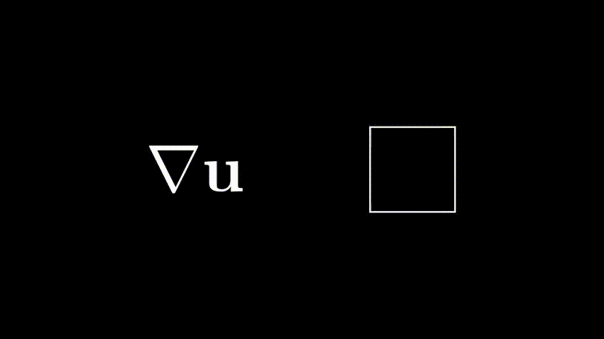
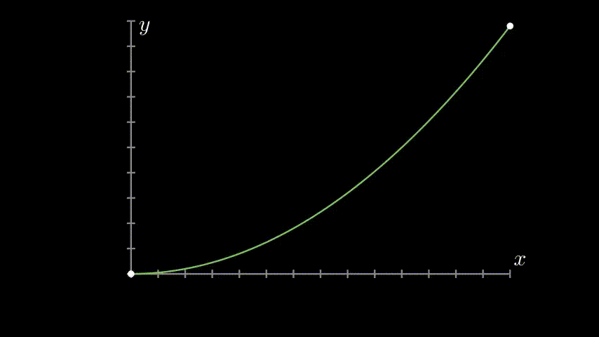

# Change position and scale of camera

### [知乎原文](https://zhuanlan.zhihu.com/p/115478126)

Import all packages：
```python3
from manimlib.imports import *
```

Create scene inherit the class of `MovingCameraScene`
```python3
class ChangePositionAndSizeCamera(MovingCameraScene):
    def construct(self):
        text=TexMobject("\\nabla\\textbf{u}").scale(3)
        square=Square()
        # Arrange the objects
        VGroup(text,square).arrange_submobjects(RIGHT,buff=3)

        self.add(text,square)
        # Save the state of camera
        self.camera.frame.save_state()
        # Animation of the camera
        self.play(
            # Set the size with the width of a object
            self.camera.frame.set_width,text.get_width()*1.2,
            # Move the camera to the object
            self.camera.frame.move_to,text
        )
        self.wait()
        # Restore the state saved
        self.play(Restore(self.camera.frame))
        self.play(
            self.camera.frame.set_height,square.get_width()*1.2,
            self.camera.frame.move_to,square
        )
        self.wait()
        self.play(Restore(self.camera.frame))
        self.wait()
```

<p align="center"></p>

```python3
class ChangePositionAndSizeCameraInAnotherScene(GraphScene,MovingCameraScene):
    CONFIG = {
        "y_max" : 50,
        "y_min" : 0,
        "x_max" : 7,
        "x_min" : 0,
        "y_tick_frequency" : 5,
        "x_tick_frequency" : 0.5,
    }
    def construct(self):
        self.setup_axes(animate=False)
        graph = self.get_graph(lambda x : x**2,
                                    color = GREEN,
                                    x_min = 0,
                                    x_max = 7
                                    )
        dot_at_start_graph=Dot().move_to(graph.points[0])
        dot_at_end_grap=Dot().move_to(graph.points[-1])

        self.add(graph,dot_at_end_grap,dot_at_start_graph)
        self.play(
            self.camera.frame.scale,0.5,
            self.camera.frame.move_to,dot_at_start_graph
        )
        self.wait()
        self.play(
            self.camera.frame.move_to,dot_at_end_grap, run_time = 2
        )
        self.wait()
```
<p align="center"></p>
