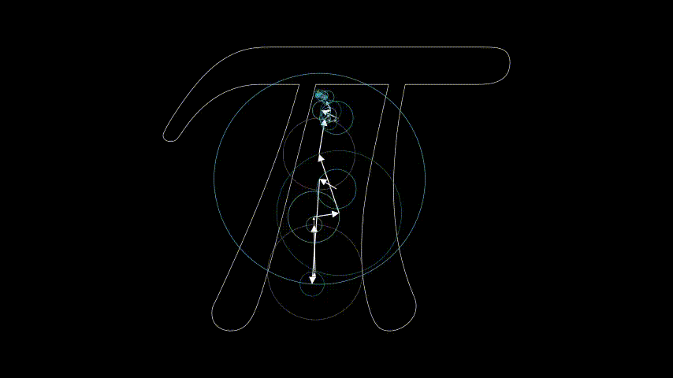
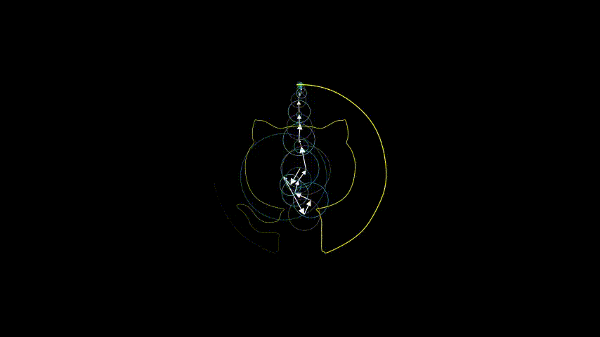

# Linear Transformation animation

### [知乎原文](https://zhuanlan.zhihu.com/p/111526064)

Copy the fourier_series.py to the root path of manim, and run following command in Anaconda Prompt：
```python3
python -m manim fourier_series.py FourierOfPiSymbol -pl
```

<p align="center"></p>

Add following code at the end of fourier_series.py
```python3
class FourierOctocat(FourierOfTrebleClef):
    CONFIG = {
        "height": 4,
        "n_vectors": 100,
        "run_time": 10,
        "arrow_config": {
            "tip_length": 0.1,
            "stroke_width": 2,
        }
    }

    def get_shape(self):
        shape = SVGMobject("Octocat.svg")
        return shape
```

And then run following command in Anaconda Prompt：
```python3
python -m manim fourier_series.py FourierOctocat -pl
```

<p align="center"></p>
