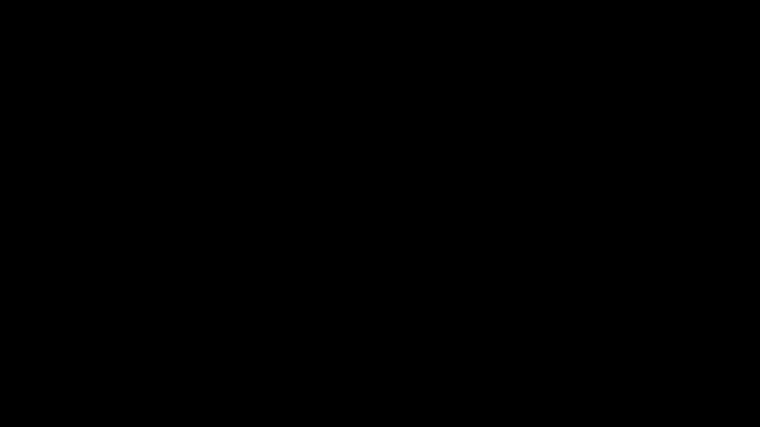
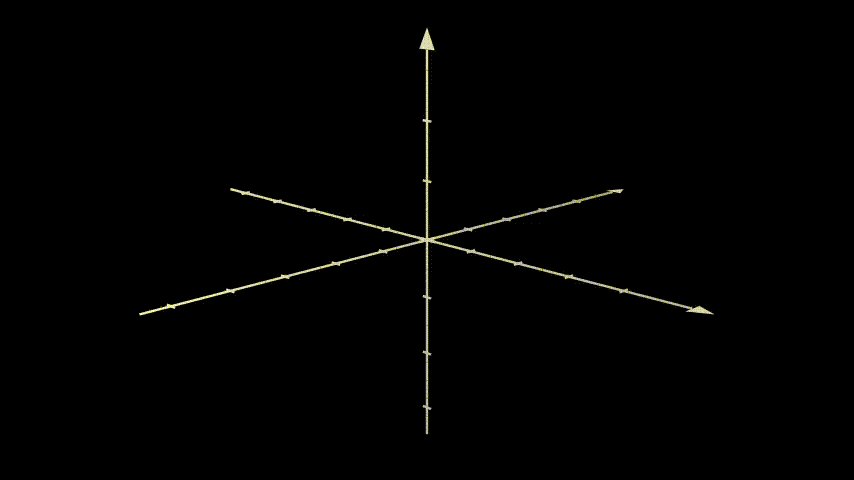

# Text 3D via manim


Import all packages：
```python3
from manimlib.imports import *

```

Create scene inherit the class of `ThreeDScene`
```python3
# This text appears in XY plane
class Text3DXY(ThreeDScene):
    def construct(self):
        axes = ThreeDAxes()
        self.set_camera_orientation(phi=75 * DEGREES,theta=-45*DEGREES)
        text3d=TextMobject("This is a 3D text").scale(2)
        self.play(ShowCreation(axes),ShowCreation(text3d))
```

<p align="center"></p>

```python3
# This text appears in XZ plane
class Text3DXZ(ThreeDScene):
    def construct(self):
        axes = ThreeDAxes()
        self.set_camera_orientation(phi=75 * DEGREES,theta=-45*DEGREES)
        text3d=TextMobject("This is a 3D text").scale(2)
        text3d.rotate(PI/2,axis=RIGHT)
        self.play(ShowCreation(axes),ShowCreation(text3d))
```
<p align="center"></p>


```python3
# To see the text in the traditional form:
class Text3DScreen(ThreeDScene):
    def construct(self):
        axes = ThreeDAxes()
        self.set_camera_orientation(phi=75 * DEGREES,theta=-45*DEGREES)
        text3d=TextMobject("This is a 3D text")
        self.add_fixed_in_frame_mobjects(text3d) #<----- Add this
        text3d.to_corner(UL)

        self.add(axes)
        self.begin_ambient_camera_rotation(0.1)
        self.play(Write(text3d))

        sphere = ParametricSurface(
            lambda u, v: np.array([
                1.5*np.cos(u)*np.cos(v),
                1.5*np.cos(u)*np.sin(v),
                1.5*np.sin(u)
            ]),v_min=0,v_max=TAU,u_min=-PI/2,u_max=PI/2,checkerboard_colors=[RED_D, RED_E],
            resolution=(15, 32)).scale(2)

        self.play(ShowCreation(sphere))
        self.wait(2)
```
<p align="center"></p>
